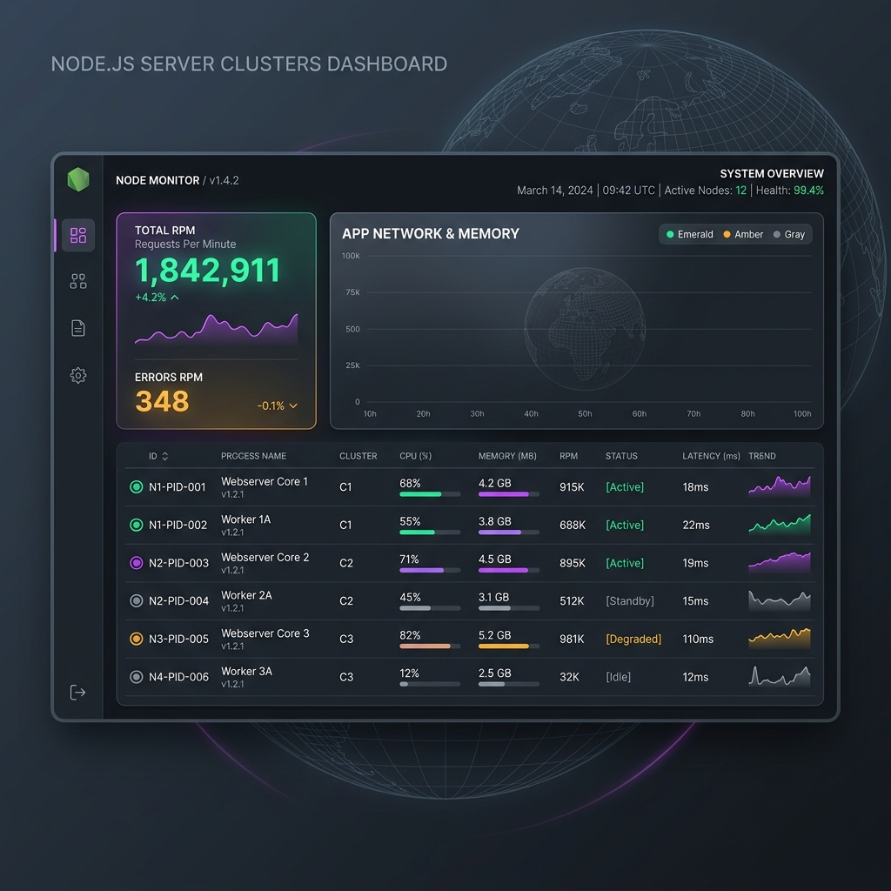

# 🚀 PM2-Watch PRO

**PM2-Watch PRO** là một hệ thống giám sát tập trung (Centralized Monitoring System) thời gian thực dành cho các cụm máy chủ Node.js chạy bằng PM2. Hệ thống được thiết kế theo cấu trúc Hub-and-Spoke với giao diện **Glassmorphism Dark Mode** hiện đại, mang lại trải nghiệm tương đương các hệ thống APM (Application Performance Monitoring) chuyên nghiệp.

 *(Hình ảnh minh họa)*

---

## 🌟 Tính năng nổi bật

1. **💻 System-Level Metrics**: Giám sát không chỉ process Node.js mà còn hiển thị theo thời gian thực CPU Load, % RAM tiêu thụ và Uptime của Hệ điều hành (OS) vật lý.
2. **📈 Real-time APM & Custom Metrics**: 
   - Tự động tích hợp `@pm2/io`.
   - Giám sát luồng mạng: **RPM (Requests Per Minute)** và **Latency (Độ trễ API)**.
   - Quét và hiển thị tự động các Custom Metrics (như *Active DB Connections*, *External API Calls*...).
3. **📊 Drill-down Charts**: Click vào từng Worker để xem biểu đồ biến động phần cứng (CPU/RAM) và Mạng (Req/min, Latency) trong 60 giây gần nhất bằng biểu đồ đường (`Recharts`).
4. **🚨 Smart Alerts**: Cảnh báo tức thời (Toasts) khi CPU vượt mức 80% hoặc một tiến trình bị lỗi/crash.
5. **📜 Live Log Streaming & FlexSearch**: 
   - Stream log (stdout/stderr) từ tất cả server theo thời gian thực.
   - Tích hợp bộ máy **FlexSearch** cho phép tìm kiếm lỗi Full-text siêu tốc độ ngay trên trình duyệt.
6. **⚡ Remote Action Gateway**: Tương tác với process từ xa (Restart/Stop) trực tiếp trên giao diện Dashboard thông qua bảo mật WebSocket.

---

## 🏗 Kiến trúc Hệ thống

Hệ thống được chia thành 3 phần chính (Monorepo):
- **`/backend` (Hub)**: Máy chủ trung tâm (Express + Socket.io) quản lý State của các cụm máy chủ và định tuyến lệnh/logs.
- **`/agent` (Spoke)**: Client cài đặt trên các máy chủ có chạy PM2. Thu thập dữ liệu OS và giao tiếp với PM2 API nội bộ, sau đó truyền về Hub.
- **`/frontend`**: Ứng dụng web React + Vite + TailwindCSS, đóng vai trò Dashboard theo dõi và ra lệnh.

---

## 🛠 Hướng dẫn Cài đặt & Chạy

---

## 🚀 Triển khai thực tế (Production) bằng 1-Click Install

Thay vì phải tải mã nguồn và gõ từng lệnh, **PM2-Watch PRO** đã được đóng gói thành một Global CLI Tool cực kỳ chuyên nghiệp. 

**Bước 1: Cài đặt qua NPM (Yêu cầu Node.js)**
```bash
npm install -g @noname260588/pm2-watch
```

**Bước 2: Khởi động hệ thống**
Bạn chỉ cần gõ đúng 1 lệnh duy nhất ở bất kỳ đâu:
```bash
pm2-watch start
```

Hệ thống sẽ tự động kích hoạt 3 tiến trình chạy ngầm (Backend, Agent, và UI) thông qua PM2. 
Mở trình duyệt tại: `http://localhost:5173`

**Các lệnh CLI hỗ trợ:**
- `pm2-watch start`: Bật hệ thống giám sát.
- `pm2-watch stop`: Tắt hệ thống.
- `pm2-watch logs`: Xem log của máy chủ trung tâm.

*Lưu ý: Để PM2 tự động bật hệ thống khi VPS khởi động lại, hãy chạy `pm2 save` và `pm2 startup`.*

---

## 🐳 Triển khai bằng Docker (Docker Compose)

Nếu bạn không muốn cài đặt Node.js trực tiếp lên server, bạn hoàn toàn có thể chạy PM2-Watch PRO dưới dạng một Container. Điều đặc biệt là Agent bên trong Container vẫn có thể giám sát được PM2 chạy trên máy Host!

**Khởi động bằng Docker Compose:**
```bash
git clone https://github.com/noname260588/pm2-watch.git
cd pm2-watch
docker-compose up -d --build
```

**Bí mật đằng sau:**
Hệ thống sử dụng kỹ thuật mount volume `~/.pm2:/root/.pm2:ro` để Agent bên trong Container có thể kết nối vào Socket RPC của PM2 đang chạy trên máy thật (Host).

---


## 🔐 Mở rộng trong tương lai
- Thêm bảo mật Token xác thực cho Agent và Frontend.
- Lưu trữ Log và History lâu dài vào cơ sở dữ liệu (MongoDB/ClickHouse).
- Quản lý phân quyền người dùng (Role-based access).

*Được phát triển với niềm đam mê dành cho High-Performance Node.js Monitoring.*
